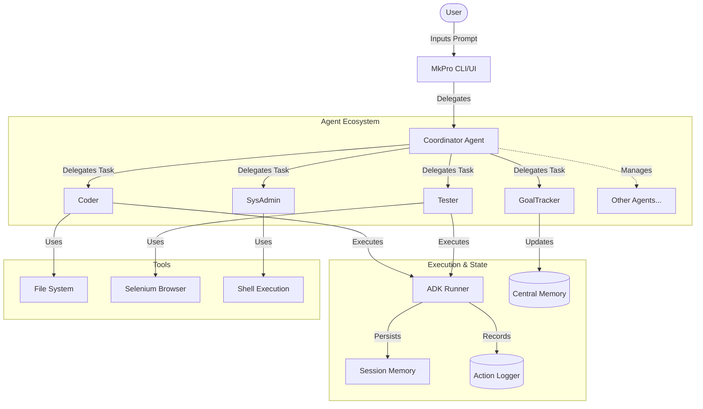

# mkpro - The AI Software Engineering Team

`mkpro` is an advanced, modular CLI assistant built on the Google Agent Development Kit (ADK). It orchestrates a team of **12 specialized AI agents** to autonomously handle complex software engineering tasks, from coding and testing to security audits and cloud deployment. It supports a multi-provider backend, allowing you to mix and match local models (Ollama) with powerful cloud models (Gemini, Bedrock).

## 🤖 Meet the Team

Your `mkpro` instance is not just a chatbot; it's a team of experts led by a Coordinator.

| Agent | Role & Capabilities |
| :--- | :--- |
| **Coordinator** | **Team Lead**. Orchestrates the workflow, manages long-term memory, and delegates tasks to the right specialist. It is your primary interface. |
| **GoalTracker** | **Project Manager**. Keeps track of ongoing session goals, creates TODO lists for complex tasks, and maintains progress in a local MapDB store. |
| **Coder** | **Software Engineer**. Reads, writes, and refactors code. Analyzes project structure and implements features. |
| **SysAdmin** | **System Operator**. Executes shell commands, manages files, and runs build tools (Maven, Gradle, npm). *Note: Restricted from modifying code directly; must delegate code changes to the CodeEditor.* |
| **Tester** | **QA Engineer**. Writes unit and integration tests, runs test suites, and analyzes failure reports to suggest fixes. |
| **DocWriter** | **Technical Writer**. Maintains `README.md`, generates Javadocs/Docstrings, and ensures documentation stays in sync with code. |
| **SecurityAuditor** | **Security Analyst**. Scans code for vulnerabilities (SQLi, XSS, secrets), runs audit tools (`npm audit`), and recommends hardening steps. |
| **Architect** | **Principal Engineer**. Reviews high-level design, analyzes cohesion/coupling, enforces design patterns, and plans refactoring. |
| **DatabaseAdmin** | **DBA**. Writes complex SQL queries, creates schema migration scripts, and analyzes database structures. |
| **DevOps** | **SRE / Cloud Engineer**. Writes Dockerfiles, Kubernetes manifests, CI/CD configs, and interacts with cloud CLIs (AWS, GCP). |
| **DataAnalyst** | **Data Scientist**. Analyzes data sets (CSV, JSON), writes Python scripts (pandas, numpy) for statistical analysis, and generates insights. |
| **CodeEditor** | **Code Manipulator**. Safely applies code changes to files with a built-in diff preview and user confirmation step. Automatically creates backups using `Maker.backItUp`. |

### Agent Interaction Flow



## 🏗️ Architecture: The Goal-Driven Core

`mkpro` is built around a rigorous goal-tracking architecture that ensures agents remain focused on the user's ultimate objective, even during long-running sessions.

### The Maker Class
The `Maker` class provides the **"heartbeat"** of this goal-driven execution. It acts as the central orchestrator that evaluates the current state of the project against the defined goal tree.

### Goal Stimulus System (`getGoalStimulus`)
To drive the agents forward, the `Maker` generates a dynamic **Goal Stimulus**. This is a context-aware report provided to the agents in every turn, derived from the `getGoalStimulus` method:

*   **Prioritized Action**: It analyzes the entire goal tree and prioritizes items based on their status: **FAILED** > **IN_PROGRESS** > **PENDING**. This ensures agents immediately address errors before continuing with the plan.
*   **Effective Leaf Goals**: It identifies "Effective Leaf" goals—these are actionable tasks that either have no sub-goals or whose sub-goals are all completed. By presenting only these leaves, the system ensures agents focus on granular, actionable tasks rather than being overwhelmed by high-level milestones.
*   **Context Optimization**: To preserve token space, it intelligently summarizes the goal tree, showing active priorities while keeping the "Pending" list concise.

## 🛡️ Safety Features

To ensure project integrity and prevent accidental data loss, `mkpro` includes built-in safety mechanisms:
- **Automatic Backups**: The `CodeEditor` agent automatically creates backups of files before performing any modifications (utilizing the `Maker.backItUp` utility).
- **Enforced Role Delegation**: The `SysAdmin` agent is strictly restricted from modifying source code directly. It must delegate all code changes to the `CodeEditor`, ensuring every change is subject to the safety pipeline and diff previews.

## 🚀 Key Features

- **Goal Tracking**: Never lose track of original user requests during complex, multi-step sessions.
- **Granular Configuration**: Assign different models to different agents. Use a cheap, fast model (e.g., `gemini-1.5-flash`) for the *Coder* and a reasoning-heavy model (e.g., `claude-3-5-sonnet`) for the *Architect*.
- **Per-Team Configurations**: Save different model setups for different teams (e.g., a "Security" team using specialized models vs. a "Dev" team using fast models).
- **Clipboard Integration**: Paste text or images directly into the terminal using `Ctrl+V`. Images are automatically saved and provided to agents.
- **Persistent Memory**:
    - **Central Store**: Project summaries and agent configurations are saved to `~/.mkpro/central_memory.db`.
    - **Local Session**: Context is managed efficiently with `/compact` to save tokens.
- **Multi-Provider**: seamless switching between **Ollama** (Local), **Gemini** (Google), **Bedrock** (AWS), **Azure** (OpenAI), and **Sarvam**.
- **Multi-Runner Support**: Choose between **InMemory**, **MapDB** (persistent), and **Postgres** (enterprise) execution environments for your agents.
- **Debug Awareness**: Agents are aware of which provider/model they are running on, helping in performance tuning and debugging.
- **Customizable Teams**: Define your own team rosters, agent descriptions, and specialized instructions using YAML files in `~/.mkpro/teams/`.

To use the new background capabilities, you simply need to tell me what you want to run and specify that it should run in the "background" or "detached."

Here is how you can use it:

### 1. Start a Service
Just ask me to run a command in the background.
*   **Example:** "Start the Spring Boot application in the background."
*   **Example:** "Run `python server.py` as a background process."

### 2. Check What's Running
Ask for a status update.
*   **Example:** "List running background jobs."
*   **Example:** "Show me the logs for the running server."

### 3. Stop a Service
Ask me to kill a specific job or all of them.
*   **Example:** "Stop the background job with ID 1."
*   **Example:** "Kill the ping process."

**Try it out:**
Do you have a specific server or script in this project you want to start up now? (e.g., `mvn spring-boot:run`)

## 💎 Supported Gemini Models

`mkpro` is optimized for the latest Gemini 3 and 1.5 series models. You can configure any agent to use these models via the `/config` command or team YAML files:

| Model | Best For |
| :--- | :--- |
| **gemini-3-pro** | **Ultimate Multimodal Reasoning**. The flagship model for complex architecture, agentic workflows, and deep interactivity. Includes 'Deep Think' reasoning capabilities. |
| **gemini-3-flash** | **Frontier Speed**. Lightning-fast intelligence for rapid iterations, testing, and system administration. |
| **gemini-1.5-pro** | **Large Context Reasoning**. Stable option for processing massive codebases (up to 2M tokens). |
| **gemini-1.5-flash** | **Efficiency**. Cost-effective and reliable for high-frequency sub-agent tasks. |

## 🦙 Supported Ollama Models

For local, privacy-first inference, `mkpro` supports a wide range of models via **Ollama**. These are ideal for running on your own hardware (e.g., Apple Silicon, NVIDIA GPUs) without sending data to the cloud.

| Model | Best For | Recommended Variant |
| :--- | :--- | :--- |
| **DeepSeek-Coder-V2** | **Coding & Architecture**. State-of-the-art open model for code generation and understanding. | `deepseek-coder-v2` |
| **Qwen 2.5 Coder** | **Code Repair & Polyglot**. Excellent at fixing bugs and supporting 92+ languages. | `qwen2.5-coder:32b` |
| **Llama 3.3** | **General Reasoning**. Powerful all-rounder from Meta with strong logic capabilities. | `llama3.3` |
| **Phi-4** | **Complex Reasoning**. Microsoft's small but mighty model, optimized for deep logical tasks. | `phi4` |
| **Mistral Large 2** | **Reasoning & Instruction**. High-performance model for complex instructions. | `mistral-large` |

To use these, ensure you have pulled them in Ollama (e.g., `ollama pull deepseek-coder-v2`) and update your config.

## ☁️ Supported AWS Bedrock Models

`mkpro` integrates with **AWS Bedrock** to provide access to industry-leading enterprise models. Configure your AWS credentials (`AWS_ACCESS_KEY_ID`, `AWS_SECRET_ACCESS_KEY`, `AWS_REGION`) to use these.

| Model | Best For | Model ID |
| :--- | :--- | :--- |
| **Claude 4.5 Opus** | **Advanced Software Engineering**. Leading model for complex, long-running coding tasks and research. | `anthropic.claude-opus-4-5-20251101-v1:0` |
| **Claude 3.5 Sonnet (v2)** | **Balanced Performance**. Exceptional at coding, multi-step reasoning, and tool use. | `anthropic.claude-3-5-sonnet-20241022-v2:0` |
| **Amazon Nova Pro** | **Enterprise Reasoning**. Powerful multimodal model for software development and mathematical analysis. | `amazon.nova-pro-v1:0` |
| **Amazon Nova 2 Lite** | **Speed & Economy**. Cost-effective reasoning with a massive 1M token context window. | `amazon.nova-2-lite-v1:0` |
| **Mistral Large 3** | **Multimodal Workloads**. High-precision model optimized for math and coding benchmarks. | `mistral.mistral-large-2411-v1:0` |

## 🛠️ Setup & Installation

### Prerequisites
- **Google Agent Development Kit (ADK)**: This project requires the **redbus version** of ADK. You must clone and install it locally from [redbus-labs/adk-java](https://github.com/redbus-labs/adk-java) before building `mkpro`.
- **Java 17+** and **Maven** (for building).
- **Ollama** (Optional): For local privacy-first inference.
- **Google API Key** (Optional): Set `GOOGLE_API_KEY` for Gemini.
- **AWS Credentials** (Optional): Set standard AWS env vars for Bedrock.

### Build
```bash
mvn clean package
```
This generates the native Windows executable `target/mkpro.exe` and a fat JAR.

### Run
```bash
./target/mkpro.exe
```

## 🏘️ Teams & Agent Workflows

`mkpro` now supports multiple agent team configurations. You can switch between different engineering squads depending on your task.

### How it Works:
1.  **Configuration Files**: Team definitions are stored in `~/.mkpro/teams/` as YAML files.
2.  **Default Team**: The `default.yaml` includes the full roster of 12 agents (Architect, Coder, DevOps, etc.).
3.  **Minimal Team**: Use `minimal.yaml` for lighter tasks requiring only the Coordinator and Coder.
4.  **Customization**: You can create your own YAML file (e.g., `audi-security.yaml`) and load it using `/team audi-security`.
